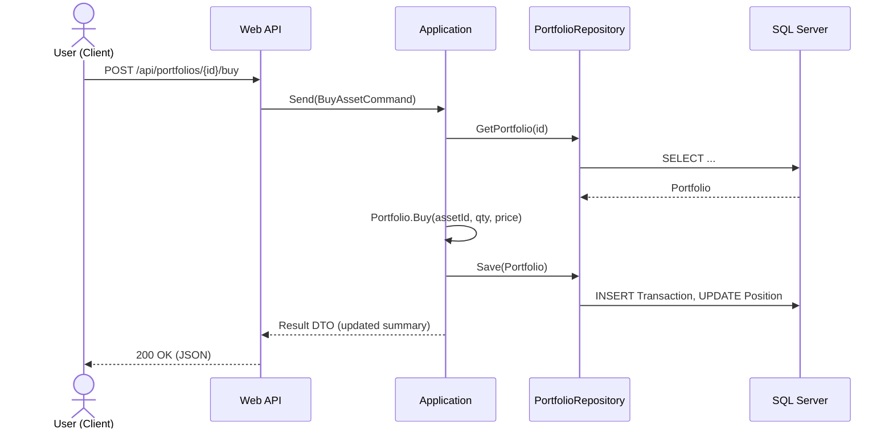

# Backend Architecture for **Financial-Portfolio**

> Target audience: developers and reviewers of the backend. This document explains how the backend is structured, how requests flow through the system, and the conventions you should follow when extending it.

## 1) High‑level Overview

The backend is an ASP.NET Core Web API organized with **Clean Architecture + DDD**. The solution uses:

* **Domain** — enterprise core: entities, enumerations, domain exceptions, invariants.
* **Application** — use cases (CQRS commands/queries), interfaces/ports, mapping.
* **Infrastructure** — EF Core persistence, repositories, Identity, external services.
* **Startup** — composition root wiring Application/Infrastructure behind interfaces so the **Web** layer depends only on **Application**.
* **Web (API)** — thin HTTP MEdiator façade (controllers/endpoints)

Supporting libs/choices already in the repo:

* **ASP.NET Core Web API** with **ASP.NET Identity** for auth.
* **EF Core (Code‑First)** to SQL Server.
* **Mapster** for DTO mapping (Automapper alternative).
* **LiteBus** (CQRS/Mediator alternative) behind a simple façade.
* **FluentValidation** - settings rules for Commands and Queries
* **NSwag** - Swagger

> The **Startup** project exists to preserve the Clean Architecture dependency rule (Presentation → Application only). All Infrastructure wiring happens in Startup and is injected into Web at runtime.


---

## 2) Solution Structure & Responsibilities

```
FinancialPortfolioSystem.Application/
FinancialPortfolioSystem.Domain/
FinancialPortfolioSystem.Infrastructure/
FinancialPortfolioSystem.Startup/
FinancialPortfolioSystem.Web/
UI/
```


## 3) Domain Model (Core)
No framework dependencies.

**Aggregates & Entities**

* **Client** — identity of the portfolio owner; owns **Portfolio**.
* **Portfolio** (aggregate root) — collection of **Positions** and **Transactions**; exposes operations `Buy`, `Sell`, `Reprice`, `Revalue` enforcing invariants.
* **Asset** — canonical instrument reference (Ticker, Name, Type: Stock/Bond/ETF).
* **Position** (ClientAsset) — quantity, average cost, realized/unrealized P\&L.
* **Transaction** — buy/sell with timestamp, price, fees (append‑only ledger).


**Invariants & Rules** (illustrative):

* Cannot sell more than current `Position.Quantity`.
* Average cost updated on buys (`moving‑average`).


## 4) Application Layer (Use Cases with CQRS)

The Application layer holds the **use‑case orchestration** and is the only layer that knows about both Domain and Infrastructure via **ports**.

### Commands & Queries

* Commands/Queries are using via a Mediator.
* They are dispatched via the **LiteBus** mediator façade, enabling pipeline behaviors similar to MediatR.
* Handlers use **repositories or factory** ports, not EF types directly.

### Pipeline Behaviors

* **ValidationPreHandler** — validate incoming command/query DTOs.(FluentValidation is used).

### Mapping

* **Mapster** configurations live under `Application/Mapping`. Handlers produce **response DTOs**; controllers should not map entities.

---

## 5) Infrastructure Layer

### Persistence

* **EF Core** `AppDbContext` with DbSets for `Assets`, `Portfolios`, `Positions`, `Transactions`, and ASP.NET Identity tables.
* Separate **EntityTypeConfiguration** classes to keep the model clean.
* **Repositories** implement `IPortfolioRepository`, `IAssetRepository`
* **Migrations** directory is source‑controlled; Schema evolves via code‑first migrations.

### Identity & Security

* **ASP.NET Identity** is used for user store and password hashing.
* **Authentication** uses **JWT Bearer**.
* **Authorization**: role-based checks. Roles are **Admin** and **Client**., e.g., `Holdings` → only available for Client.

---

## 6) Web (Presentation/API)

* **Controllers** are thin; they accept request DTOs, send commands/queries through the mediator, and return typed results with ProblemDetails for errors.
* **Error Handling**: global exception filter/middleware maps `DomainException` → 400, `ModelValidation` → 400, unhandled → 500.

### Example Request Flow



---

## 7) Database Design

* **Tables**: `AspNetUsers`, `AspNetRoles`, `AspNetUserRoles`, `Assets`, `ClientPortfolios`, `ClientAssets` (positions), `ClientTransactions`.
* **Indexes** could be introduced for performance gain. 


## 8) Error Handling & Problem Details

Define a set of well‑known application exceptions:

* `Different DomainException` based on the domain model (validation/invariant broken)
* `ModelValidationException`
* `AdminUserSeedingException`

ExceptionHandlerMiddleware returns the corresponding status code.

## 9) Security Model

* **AuthN**: ASP.NET Identity; passwords hashed with PBKDF2 (Identity default). Two roles are available - Client and Admin.

## 10) Testing Strategy in the future

Domain tests — pure in‑memory tests for aggregates and value objects.

Application tests — handler tests with InMemoryDbContext or SQLite; verify transactions and mapping.

API tests — minimal integration tests using WebApplicationFactory against a test DB.

Folder proposal:


## 11) Observability - future propsitions
•	Logging: structured logs (Serilog or built in) with CorrelationId and user id claims.
•	Health Checks: /health for liveness and /ready for DB/Identity checks.
•	Metrics: minimal counters (requests, error rate, command timings). Hook into OpenTelemetry when needed.

## 12) Configuration & Environments

* `appsettings.json` with  connection string and application secret used in JWT token generation

## 13) API Surface (initial)

* `POST /api/identity/register` — create user
* `POST /api/identity/login` — issue token
* `PUT /api/identity/changepassword` — change password
* `GET /api/assets` — list assets (both Admin and Client)
* `POST /api/assets` — create (Admin)
* `PUT /api/assets` — edit (Admin)
* `DELETE /api/assets` — delete (Admin) 
* `GET /api/portfolios/ — get portfolio summary 
* `POST /api/portfolios/buy` — buy asset (Client)
* `POST /api/portfolios/sell` — sell asset (Client)
* `GET /api/portfolios/metrics` — ROI/market value (Client)

> The only endpoints that do not require Authorization are for registering a user and logging.

## 15) Extension Points & Roadmap
• Implement integration and unit tests.
•	Swap mock market data provider with a real API adapter.
•	Add outbox pattern for reliable domain event publishing.
•	Introduce specification pattern for complex queries.
•	Add refresh tokens and device tracking to improve auth.
•	Implement export (CSV/PDF) and notifications.


## 16) Coding Conventions (abridged)
•	Use primary constructors
•	Keep controllers ≤ 50 LOC; no business logic in controllers.
•	One handler per command/query and a separate validation class if needed ; do not share mutable state.
•	Prefer Value Objects over primitive obsession; guard invariants in factories.
• Communicate only with aggregate roots, use Factories and Repositories as ACL(Anti Corruption Layer)
•	Use Utc everywhere (persisted as UTC in DB).

## 17) Appendix — Reference DI registration (pseudo code)
// Startup project
public static class DependencyInjection
{
    public static IServiceCollection AddApplication(this IServiceCollection services)
    {
        services.AddLiteBus();            // mediator
        services.AddValidators();         // if FluentValidation is added later
        services.AddMapster();            // mapping profiles
        return services;
    }

    public static IServiceCollection AddInfrastructure(this IServiceCollection services, IConfiguration cfg)
    {
        services.AddDbContext<AppDbContext>(o =>
            o.UseSqlServer(cfg.GetConnectionString("Default")));

        services.AddIdentityCore<AppUser>()
            .AddRoles<IdentityRole>()
            .AddEntityFrameworkStores<AppDbContext>();

        services.AddScoped<IUnitOfWork, EfUnitOfWork>();
        services.AddScoped<IPortfolioRepository, PortfolioRepository>();
        services.AddScoped<IAssetRepository, AssetRepository>();
        services.AddScoped<IMarketDataService, MockMarketDataService>();
        services.AddTransient<IClock, SystemClock>();

        return services;
    }
}


**That’s it**. This is the living blueprint for the backend. When you add a feature, start at the **Application layer** (command/query + handler + DTO + tests), model the change in **Domain**, implement the port in ** Infrastructure**, and expose it via a thin ** Web** endpoint.
